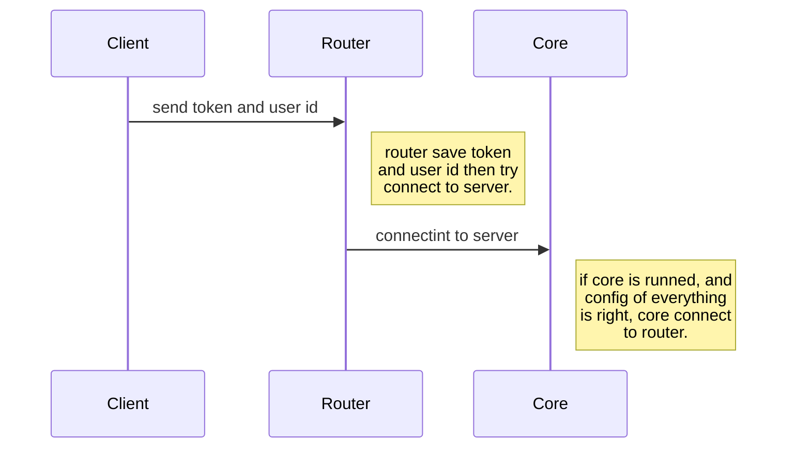
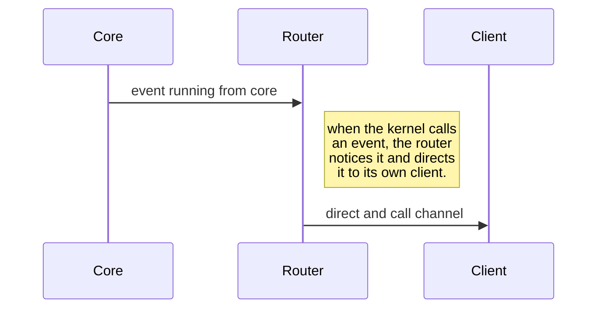

# Rouket Document


The Rouket is a socket router service can used in microservice infrastructures, The Roucket establishes a connection between the main server and the client server. The method of communication is that first the clients connect to the router. After connecting, the router tries to establish a connection between itself and the server. If a connection is established, when an event is called from the main server, it is routed to the client server via the router.

## File Structure
This project is base on typescript.
```
.
├── src
│   ├── app
│   │   ├── Connections
│   │   │   ├── ClientConnection.ts
│   │   │   ├── Connections.ts
│   │   │   └── ServerConnection.ts
│   │   └── Core
│   │   │   ├── Client.ts
│   │   │   ├── ClientCollection.ts
│   │   │   ├── Core.ts
│   │   │   ├── Logger.ts
│   │   │   └── Router.ts
│   ├── config.ts
│   └── index.ts
└── test
```

## UML diagrams
The router is connected to the core by `Laravel Echo` and the core connected to the router by `Laravel Echo Server`. Also, the connection of the clients with the router is established by his `socket.io`, which is from the side of the router by `socket.io` and from the side of the client by `socket.io-client`.

In order to establish all the connections of this ecosystem, the following process is performed:



And for getting data in the form of realtime, the following process is performed:



##  Getting Started

If your laravel application want to connect to socket router, you need to install [`laravel-echo-server`](https://github.com/tlaverdure/laravel-echo-server) in your core server and install [`socket.io-client`](https://socket.io/docs/client-installation/) in your client server, then follow below steps.

### installation
First clone this project into your server:
```bash
git clone https://github.com/
```
Then install npm modules:
```bash
npm install
```

if you want deploy this install npm modules with development modules:

```bash
npm install -D
```
Congratulations, You have successfully installed Rouket, now it's time to run!

### Configuration
If you have not copied the `.env.example` file to a new file named `.env`, you should do that now and set your configuration.

### Run Guide
run this command for compiling the `ts` codes to `js` and start the project:
```
npm run start
``` 
when you run this command, you have a folder with the name of `dist`, now you can enjoy the commiunations between your separate projects.
